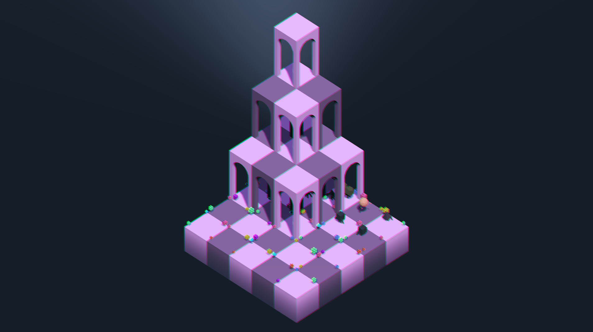
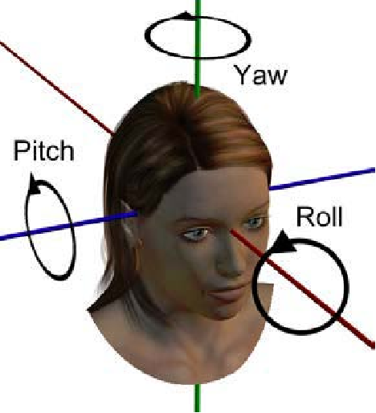

# Zappy GUI - Devlog - 5

## Table of Contents
1. [Godot Was the One Waiting All Along](#51---godot-was-the-one-waiting-all-along)
2. [Into the (Un)Known](#52-into-the-unknown)
3. [Looking Down On Our Own Game](#53-looking-down-on-our-own-game)

<br>
<br>

# 5.1 - Godot Was the One Waiting All Along
And it was waiting because it has been months since I left the Godot GUI for this project in what feels like a too long hiatus. This was where I started working in *Zappy* from, the reason I was called to form a team, my role, my reason to exist. That is, until some other projects came my way and time started to be scarce and... Well, this is not important, the matter of the fact is that we're back right were we started, now with a full server+client development in almost production states and finally back to having fun with graphics. The only problem is that its been so long that getting back into the GUI codebase has been sort of hard and, above that, has made me see it with other eyes, a new pair that has revealed a painful truth: the existing codebase is quite bad. It's only natural, this was from quite some time ago, when my Godot knowledge was quite green and I was learning-on-the-go, and this feeling I'm having today, upon my return, is just a sign of things-having-been-learned. Take all of this and add to the mix my tendency to rebuild things as a way of solidfying knowledge, reestructure work and refine codebases, ad you'll find me at the beginning of the GUI process, back to square 1, but with a backpack full of new tools and ideas. Actually good for us, you and me, as this gives us the possibility of logging all the Godot GUI process from the very beginning, so if you find yourself reading this, not knowning too much (or anything at all) of how Godot works, I'll take you for a ride, destination: a simple graphic interface hooked up to our *Zappy* network and infraestructure, all with custom models and in full 3D glory. We'll work in a Blender->Godot pipeline and go through the whole process, from initial setup to finish touches, together, as a team, as an unbreakable force of design and development. 

Well, to be fair and exact, what I'll do is try to log every step of the way so that it is useful as a sort of guide. I'm avoiding the term tutorial because I won't be able to break down everything step by step, but I hope that combining the project files with the logs will suffice to give anyone a manageable entry point to the basis of the tool, as well as some general game development and graphics set up nuggets of knowledge that can be taken to any technical context. I don't know how things will go and what we'll end up having in our hands (repos), but just in case something is missing, unclear, unfinished, or whatever bad state else, and you need some further explanation or clarification, don't hesitate to contact me. I'm always available!

And with this out of the way, before going into the initial setup of the Godot GUI project, some style and technical decisions that are already made on my side, and following those we'll:
- Go for a full 3D GUI that connects to the *Zappy* server as an **observer**, receiving regularly updated JSON-formed data from it, from which it will render the game session as the AI clients play.
- Set up an **isometric** camera with full control given to the GUI user so they can rotate it and zoom in and out
- Model everything we're going to need in Blender (player models, resource objects, tiles, ornaments, EVERYTHING!!) and import it to Godot, managing assets there
- Aim for a stylized 3D aesthetic, although we'll get into the details of it way down the line, when they start being relevant
- Overlay a sign-based UI navigated via mouse and represented in hover-responding information frames that display data about tiles, players, resources and everything, well, hoverable
- Give the possibility to overlay the server data stream alongisde the game's representation
- Add some game-config buttons to manage visualization, speed, and anything we deem necessary or interesting

I think that's the gist of it. I might be forgetting something, it's 14:20, I just ate and my brain is not braining too much. Anyways, just so you can visualize the state of the GUI that was left in hiatus, which is very loosely representative of what we're going to do in this new build, here's an image. Then, we'll get to work!



> *This will also be an interesting BEFORE picture for when we have the AFTER*

<br>
<br>

# 5.2 Into the (Un)Known
Besides any other consideration we can make right now regarding this GUI or our relationship with Godot, we can identify, right here and right now, a couple of facts on our side: 1) This is a GUI, not a full Godot game per se, so we won't have to go into input design and user interaction beyond the UI, and 2) This is a GUI, so its just a visual representation of logic that's already built, so we can be certain of an array of stuff we are going to need from the get go. And with it, I personally also have the past experience with the previous work done on the GUI, so that gives me even more K N O W L E D G E about what we're going to do for our **step one: set up our data structures and shared objects, and create the autoloads we'll use to handle them**. Easy, straightforward, not really Godot-related beyond them needing to be written in gdscript and set up via the engine's editor.

> *What's an autoload? Think of them as startup-instantiated singleton-like nodes that remain available for the entire app lifetime, making them ideal for shared state, global services, and cross-scene coordination. They are globally accessible by name in practice, but not truly global scope in the language sense, and are great for app-wide orchestration.*

Things might change down the line, but at our very beginning we can set up everything we need with **4 autoloads**:

<br>

| Autoload name | File | Purpose |
|---|---|---|
| `GameConfig` | `scripts/autoloads/GameConfig.gd` | Constants and enums |
| `GameData` | `scripts/autoloads/GameData.gd` | Single source of truth for game state |
| `CommandProcessor` | `scripts/autoloads/CommandProcessor.gd` | Translates commands into signals |
| `MockServer` | `scripts/autoloads/MockServer.gd` | Development-only fake server |

<br>

This can be easily registered via the panel found in `Project → Project Settings → Autoload`, each one of the register process creating a new, blank script in the path we fix for them, which for me will be `res://scripts/autoloads/`. For our first """"playable"""" build, which will only contain a basic environment and a rigged camera, we'll just have to fill in the `GameConfig` and `GameData` scripts, the other two can wait until we have the logic and visual foundations of the GUI in place. Tackling `GameConfig` first, we will use this as a **pure data container**, i.e. no logic, no node references, no `_ready()` (Godot's scripts entry points), no nothing besides all the magic numbers and configuration values that the GUI will use in other scripts, which we gather here so that we don't scatter them around, as well as to avoid repetition. We actually don't need too much information, just a handful of entries that we can more or less predict we will need in other corners of the app. For example, because we'll build the world by spatially concatenating 3D modeled tiles, we can infer that a `TILE_SIZE` and a `TILE_GAP` constants will be needed, so that the arena building script can work with pre-set offsets. We also know that our little guys will have animations for every command, and these will need to be tied to general timing of the server-client communications, so animation duration numbers sound, too, like something we will need. And so on and so forth. We'll go with this for now:
```python
# scripts/autoloads/GameConfig.gd
extends Node

# --- Map ---
const TILE_SIZE: float = 1.0
const TILE_GAP: float = 0.0   # Set to 0.05 later if you want visible separation

# --- Timing ---
const MOVE_DURATION: float = 0.25     # seconds per tile move tween
const ROTATE_DURATION: float = 0.15   # seconds per 90° rotation tween
const DEATH_DURATION: float = 0.4

# --- Network ---
const WS_OBSERVER_HANDSHAKE: Dictionary = {"type": "GRAPHIC"}  # sent after WS connection

# --- Resources ---
const RESOURCE_NAMES: Array[String] = [
    "nourriture", "linemate", "deraumere",
    "sibur", "mendiane", "phiras", "thystame"
]

# --- Enums ---
enum Orientation { NORTH = 0, EAST = 1, SOUTH = 2, WEST = 3 }
enum TileType { BASIC, ARCH_1F, ARCH_2F, ARCH_3F }
enum PlayerStatus { NORMAL, INCANTATION, BROADCASTING, DEAD }

# --- Teams (extend as needed) ---
const TEAM_COLORS: Dictionary = {
    "Alpha": Color(0.9, 0.2, 0.2),
    "Beta":  Color(0.2, 0.4, 0.9),
    "Gamma": Color(0.2, 0.8, 0.3),
    "Delta": Color(0.9, 0.8, 0.1),
    "Epsilon": Color(0.8, 0.3, 0.9),
}
```

> *NOTE: I'm labeling the code snippets with "python" (you'll only notice this in the raw file visualization, but just in case) because "gdscript" is not supported in the syntax highlighter. Python is the most similar language in this regard, so that will have to work. The alternative is plain white code blocks, which would be a disgrace*

As you can see, nothing crazy, just the bare minimum we'll need to reach our first milestones. On the `GameData` side we'll have to be more exhaustive, but once again, very simple stuff. This will be the **single source of truth** for all game states, and it will hold all the data. It won't build visuals, move players, or interpret commands. This is just the place were systems will read from while being wired to its signals, always listening for changes. Will settle on this:
```python
# scripts/autoloads/GameData.gd
extends Node

# --- State ---
var map_size: Vector2i = Vector2i.ZERO
var time_unit: int = 100
var tick: int = 0
var teams: Dictionary = {}   # team_name -> { player_count, connections }
var tiles: Dictionary = {}   # Vector2i -> TileData
var players: Dictionary = {} # int (id) -> PlayerData
var eggs: Dictionary = {}    # int (id) -> EggData

# --- Signals ---
# Emitted once when the initial full state burst is complete
signal world_initialized
# Emitted when individual entities change
signal tile_changed(pos: Vector2i)
signal player_changed(id: int)
signal player_removed(id: int)
signal egg_added(id: int)
signal egg_removed(id: int)
signal team_changed(name: String)
signal tick_updated(tick: int)
signal time_unit_changed(t: int)
signal game_over(winning_team: String)

# --- Inner classes for typed data ---
class TileState:
    var pos: Vector2i
    var resources: Dictionary  # resource_name -> int
    var player_ids: Array[int]
    var egg_ids: Array[int]

    func _init(p: Vector2i) -> void:
        pos = p
        resources = {}
        for r in GameConfig.RESOURCE_NAMES:
            resources[r] = 0
        player_ids = []
        egg_ids = []

class PlayerData:
    var id: int
    var team: String
    var pos: Vector2i
    var orientation: int  # GameConfig.Orientation
    var level: int
    var inventory: Dictionary
    var status: GameConfig.PlayerStatus

    func _init(pid: int) -> void:
        id = pid
        inventory = {}
        for r in GameConfig.RESOURCE_NAMES:
            inventory[r] = 0
        status = GameConfig.PlayerStatus.NORMAL

class EggData:
    var id: int
    var layer_id: int
    var team: String
    var pos: Vector2i

# --- Accessors ---
func get_tile(pos: Vector2i) -> TileState:
    return tiles.get(pos)

func get_player(id: int) -> PlayerData:
    return players.get(id)

func get_egg(id: int) -> EggData:
    return eggs.get(id)
```

A bunch of variables, signals, shared classes and accessors. Think of this as our tool box, or he script-in-between, the one that will let our other scripts talk to each other while maintaining independence. And with this, we're ready for our first scene. We'll call it `Main.tscn`, it will just contain a `WorldEnvironment`, a `DirectionalLight3D` and a `CameraRig.tscn` sub-scene, which will be our main focus in a minute. I'll also add a `CSGBox3D` node as to have something to be rendered by the camera and be able to check out how the rig is behaving as I code its script. There's no need for configuration in any of these nodes right now, we just need to have them. BUT before moving on, let's give ourselves an **architecture rule** regarding how to build scenes, in order to avoid a similar mess to the one I left behind in the previous version of this GUI: **every scene has exactly one "root" script that owns that scene's behavior**. Scripts never reach into sibling scenes. Communication always goes upward via signals or through the autoload layer (`GameData`, `CommandProcessor`). The hierarchy will follow this tree:
```
Main (Node3D)          ← orchestrator, owns managers
├── WorldRoot          ← parent for all tile instances
├── EntityRoot         ← parent for players, eggs
├── Camera             ← CameraRig scene instance
├── HUD                ← CanvasLayer, always visible
└── ConnectionScreen   ← CanvasLayer, shown before connection
```
And `Main.gd` will instantiate managers as child nodes, never as autoloads, so that we keep the autoload list minimal and **make the managers restartable**, something we'll need for reconnection purposes.

And we're off to our First Big Thing: scripting the axonometric camera!

<br>
<br>

# 5.3 Looking Down On Our Own Game
I'm sure there must be dozens of ways of setting up an axonometric camera rig in Godot, so this will be just mine. If you wish to explore other possibilities, go ahead, we're in an open learning relationship. My only advice is that whatever path you choose, try to pick one that can be built in isolation and tested on an empty scene, so that this becomes the sole step in which we force ourselves to get the math right without visual distractions. After having an operational and reviewed rig, we can start doing stuff with it, but developing this GUI is no different as developing any other piece of sofware: tackle challenges one by one, avoid mixed-implementation debug contexts, try to isolate steps as strongly as you can.

To me, this is one of those *things* that can easily start feeling a bit overwhelming because of the terminology and the accumulation of operation layers. Not that the camera rig we have in mind is a complex thing, but learning how it works in detail and how to, well, script it can so easilly throw us into the "yeah, whatever, let's just make this work, I saw a script that did the thing" mood, so we need to tread carefully. After all, the point right now is to **learn** how to set up an axonometric camera in Godot in multiple fronts: theoretically, conceptually, godot-editor-wise, script-wise, etc. So I'd rather take it slow, lay out every single consideration that I think is important for the process, make decisions and only after doing so, go into script writing mode. Sorry if this becomes tedious, but sometimes this is the best course of action. Trust the process if you don't trust me.

Whatever our paths may be, what we're trying to achieve is the same: a camera with no perspective distortion at all, under which gaze all our tiles and their contents will read clearly regardless of distance, with depth implied by the fixed angle rather than vanishing points. I chose this orthographic set up because 1) I like it and 2) it will be easier to apprehend at *Zappy*'s default high speed. We don't need immersion, but ease of read and data representation. And Godot, specifically, makes the setup exremely easy, we just need to set the `Camera3D` node's projection to `PROJECTION_ORTHOGONAL` and control the scale via `Camera3D.size`, instead of field of view. Around this, my way of building an axonometric Godot camera is via a **nested set of `Node3D` nodes ending in a `Camera3D`. Something like this:

```
CameraRig (Node3D)       ← this is the root; the script lives here
└── Pitch (Node3D)       ← rotates on the X axis (the vertical tilt)
    └── ZoomArm (Node3D) ← translates on the Z axis (distance from subject)
        └── Camera3D     ← the actual camera; set to Orthogonal projection
```

This structure has each of its nodes doing **exactly one thing**, and the separation is the key insight in itself, because trying to do everything in a single node will lead to operations interfering with each other in confusing ways, all of those that quickly lead to brain soup. In a little more depth:
- **CameraRig** sits at the world position we want to look at, which for us is the game arena. When we pan, we move this node. Its Y rotation controls which compass direction the camera faces (the **yaw**, or "spin around the vertical axis"). This is functionally the **tripod base**.
- **Pitch** is a child of `CameraRig`, so it inherits the tripod's position and the fixed isometric angle (~30° from horizontal, so `rotation_degrees.x = -30` since negative X tilts the front downward). Because it's a child, it rotates relative to CameraRig's already-applied yaw, which makes both rotations compose correctly without any manual matrix math (YAY!).
- **ZoomArm** is a child of `Pitch`, so it inherits position + yaw + tilt. Its only job is to translate on its **local** Z axis. Because `Pitch` has already tilted the local axes, moving `ZoomArm` on Z moves the camera along the tilted "look" axis, i.e., backward away from the subject. **This is how we zoom: push `ZoomArm` further back, the camera moves away; pull it in, the camera gets closer**. 
- **Camera3D** is the leaf node. It sits at the end of the arm, pointing along its local -Z axis (which Pitch has already aimed downward at the scene). Here's were `PROJECTION_ORTHOGONAL` is set, and this node has no script: it is entirelly controlled by its parent's transforms.

> I find the following image, although weird, quite useful. All these *yaw*, *pitch*, *roll* and etcetera lingo can be confusing, so making the related movements yourself with your own 3D head can clarify thing by a lot:
>
> 
>
> As a clarification, in orthographic mode distance doesn't actually change what the camera sees. Physical distance from the subject is irrelevant to the rendered size. **For this project, zoom is instead controlled by `Camera3D.size`**, the larger the value, the more world fits in the frame. The `ZoomArm` translation matters if we ever want to avoid clipping through geometry, but the visual "zoom" sensation comes from changing `size`, not from moving the arm.

Now, the script itself is comprised of only a handful of functions, and really it is as basic as a short piece of code containing 1) initial setup of the camera, 2) keyboard and mouse hooks, and 3) lerp helpers. There's really nothing else needed for now, and all together looks like this:

```python
# Axonometric camera manager (set up + controller)
extends Node3D

@onready var _pitch: Node3D = %Pitch
@onready var _zoom_arm: Node3D = %ZoomArm
@onready var _camera: Camera3D = %Camera

@export var move_speed: float = 8.0
@export var zoom_speed: float = 2.0
@export var lerp_speed: float = 12.0
@export var pitch_angle_deg: float = 30.0
@export var initial_yaw_deg: float = 45.0

var _pos_target: Vector3 = Vector3.ZERO
var _size_target: float = 10.0
var _yaw_target: float = 0.0
var _bounds: Rect2 = Rect2()
var _initialized: bool = false

func _ready() -> void:
	_pitch.rotation_degrees.x = -pitch_angle_deg
	rotation_degrees.y = initial_yaw_deg
	_yaw_target = PI * 0.25
	rotation.y = _yaw_target
	_camera.projection = Camera3D.PROJECTION_ORTHOGONAL
	
func initialize_for_map(size: Vector2i) -> void:
	var spacing: float = GameConfig.TILE_SIZE + GameConfig.TILE_GAP
	var center := Vector3((size.x - 1) * spacing * 0.5, 0.0,
							(size.y - 1) * spacing * 0.5)
							
	var span: float = max(size.x, size.y) * spacing
							
	position = center
	_pos_target = center
	_size_target = span * 0.7
	_camera.size = _size_target
	
	var pad: float = span * 0.5
	_bounds = Rect2(center.x - span - pad, center.z - span - pad,
					span * 2.0 + pad * 2.0, span * 2.0 + pad * 2.0)
					
	_initialized = true

func _process(delta: float) -> void:
	if not _initialized:
		return
	_handle_keyboard(delta)
	_apply_lerp(delta)
	
func _unhandled_input(event: InputEvent) -> void:
	if event is InputEventMouseButton:
		if event.button_index == MOUSE_BUTTON_WHEEL_UP:
			_size_target = max(2.0, _size_target - zoom_speed)
		elif event.button_index == MOUSE_BUTTON_WHEEL_DOWN:
			_size_target = min(60.0, _size_target + zoom_speed)
			
	if event is InputEventMouseMotion and event.button_mask & MOUSE_BUTTON_MASK_MIDDLE:
		var drag: Vector2 = event.relative * 0.02
		_pos_target += Vector3(-drag.x, 0.0, -drag.y).rotated(Vector3.UP, rotation.y)

func _handle_keyboard(delta: float) -> void:
	var dir := Input.get_vector("ui_left", "ui_right", "ui_up", "ui_down")
	if dir != Vector2.ZERO:
		var world_dir := Vector3(dir.x, 0.0, dir.y).rotated(Vector3.UP, rotation.y)
		_pos_target += world_dir * move_speed * delta
		
	if Input.is_action_just_pressed("rotate_left"):
		_yaw_target -= PI * 0.5
	if Input.is_action_just_pressed("rotate_right"):
		_yaw_target += PI * 0.5
	
	_yaw_target = wrapf(_yaw_target, -PI, PI)

func _apply_lerp(delta: float) -> void:
	var t: float = clamp(lerp_speed * delta, 0.0, 1.0)
	
	_pos_target.x = clamp(_pos_target.x, _bounds.position.x,
						_bounds.position.x + _bounds.size.x)
	_pos_target.z = clamp(_pos_target.z, _bounds.position.y,
						_bounds.position.y + _bounds.size.y)
						
	position = position.lerp(_pos_target, t)
	rotation.y = lerp_angle(rotation.y, _yaw_target, t)
	_camera.size = lerpf(_camera.size, _size_target, t)
	
func focus_on(world_pos: Vector3) -> void:
	_pos_target = Vector3(world_pos.x, 0.0, world_pos.z)

```

There are, though, a healthy amount of considerations to be extracted from this script, some related to general workings (like how to manage the lerping and how to setup the initial values for the correct Axonometric POV), some related to the *hows* of Godot.

### Coordinate systems and local vs world

First of all, we need to have in mind some considerations regarding how Godot manages coordinate systems, as well as the usual clash between local and world space. In Godot, **every `Node3D` has a `local space` and a `world space`**:
- **World space** is fixed: X points right, Y points up, Z points towards the viewer (out of the screen)
- **Local space** is relative to the node's current transform. If you rotate the node 45° on Y, its local X axis no longer points world-right, it points world-northeast.

For the camera rig:

- **Panning** happens in **world space**, but the input direction is first rotated by the rig's current yaw so that "right" on the keyboard always means "right from the camera's perspective" rather than always meaning "world +X". The .rotated() call transforms the input intent, not the coordinate space of the movement itself. The input vector is rotated by the rig's yaw before being applied, so that movement always follows the camera's facing direction. This is equivalent to moving in local space, but done explicitly in world space rather than relying on the node's transform to do it implicitly.

```python
var world_dir := Vector3(dir.x, 0.0, dir.y).rotated(Vector3.UP, rotation.y)
_pos_target += world_dir * speed * delta
```

> *We avoid something like `translate_object_local()` to avoid implicit transformations. Scripting it via world tranform * yaw rotation vector makes the line self explanatory. Code = documentation, and so on*

- **Pitch** is applied in `Pitch` node's local X, which is already correctly oriented because `CameraRig`'s yaw has been applied at the parent level.
- **Zoom** (changing `Camera3D.size`) operates in camera space and doesn't need any coordinate transform

> If you want to dig deeper into the screen space drag translation into the camera's position transformation with the consideration of the yaw (what a horrible way to sum this up), we can briefly break it down. What we're doing is taking the `drag vector`, which starts in screen space (mouse X maps to world X, mouse Y maps to world Z) and spuning it to align with where the camera is actually facing. Moving a vector in its space to another position is done via **vector addition**, which in our case means taking the rig's actual position and adding to it the drag->movement result. The spun part is straight forwardly done via `.rotation(AXIS, ANGLE)`, which we do by taking the Y axis (`Vector3.UP`) and the yaw value (`rotation.y`).
>
> Under the hood, this is computed via **[Rodrigues rotation](https://en.wikipedia.org/wiki/Rodrigues%27_rotation_formula)**, which rotates the vector around the given axis by the given angle. To my understanding, this is the equivalent to constructing a rotation matrix around that axis and multiplying, just in a more efficient way (by reducing steps and etc).

<br>

### Lerping It Up
Not that this is extremely important for the rig to be considered to be *working*, but without lerping its movement (or anything in a game-design context, mostly), moving the camera around would be robotic and awfully snapping. Laying out what [lerping](https://en.wikipedia.org/wiki/Linear_interpolation) is and entrails here goes beyond the scope of this log, so let's just leave it in what is strictly relevant for our camera rig script: **we'll work in a separation of the `target` and the `current` position values so that we can interpolate movements along every `_process()` frame/tick**. In other words, an input event modifies a `_target` variable immediately, and `_process()` sequentially lerps the current status to the lerped target.

```python
# On input:
_pos_target += pan_delta

# In _process():
position = position.lerp(_pos_target, lerp_speed * delta)
```

> `lerp(a, b, t)` returns a value `t` of the way from `a` to `b`. When `t` is small (near 0) movement is slow; when `t` is large  (near 1), movement is fast. **Using `lerp_speed * delta` means the speed is framerate-independent: the camera covers the same proportion of remaining distance per second regardless of FPS**.
>
> The result is **ease-out motion**: the camera starts fast and slows as it approaches the target, which feels natural (or at least feels *good*).
>
> Some advice: `lerp_speed * delta` can exceed 1.0 at low framerates (for example, `lerp_speed = 12, delta = 0.1` -> `t = 1.2`). `lerp()` with `t > 1` overshoots. So, **ALWAYS CLAMP**: `clamp(lerp_speed * delta, 0.0, 1.0)`;
>
> Some further advice: **for rotation use `lerp_angle()`** instead of `lerpf()`. `lerp_angle` correctly handles the wraparound at +-180°, so a rotation from 350° to 10° goes through 0° instead of spinning 340° the wrong way. I learned about this the hard way. Don't be like me.

<br>

### Snap Rotation
If you've ever played an axonometric game you'll know that they almost always ("almost" typed for safety) the view is snap-rotated in 90° steps around the visualization targets. We'll do the same, of course, which calls for a **special case of the lerp pattern**:

```python
if Input.is_action_just_pressed("rotate_left"):
	_yaw_target -= PI * 0.5 # 90° in radians
if Input.is_action_just_pressed("rotate_right"):
	_yaw_target += PI * 0.5
```

Because `_yaw_target` is a float that `lerp_angle` smoothly approaches, the rotation animates to the next 90° snap rather than teleporting. The input sets the destination, lerp handles the journey, so to speak.

<br>

### Input Handling (UI)
I want to have (to preserve, really, from the previous dead version) three kinds of input regarding the camera, all with different handling:

#### 1. Keyboard pan (held keys)
Checked every frame in `_process()` using `Input.get_vector()`. This returns a `Vector2` whose axes are -1 to +1 based on which keys are held. This is then rotated by the rig's current yaw so "forward" means "toward where the camera is facing", not always "toward world -Z":

```python
func _handle_keyboard(delta: float) -> void:
	var dir := Input.get_vector("ui_left", "ui_right", "ui_up", "ui_down")
	if dir != Vector2.ZERO:
		var world_dir := Vector3(dir.x, 0.0, dir.y).rotated(Vector3.UP, rotation.y)
		_pos_target += world_dir * move_speed * delta
```

#### 2. Middle-mouse drag pan
Handled in `_unhandled_input()` using `InputEventMouseMotion`. The `event.relative` gives pixel delta since last frame. Scale it down (pixels are much larger than world units), then apply the same yaw rotation:

```python
if event is InputEventMouseMotion and event.button_mask & MOUSE_BUTTON_MASK_MIDDLE:
	var drag := event.relative * 0.02
	_pos_target += Vector3(-drag.x, 0.0, -drag.y).rotated(Vector3.UP, rotation.y)
```

The negation on `drag.x` is because mouse moving right should pan the camera right (moving the world left), but the sign depends on the coordinate conventions. This can be adjusted to feel.

#### 3. Scrool Wheel Zoom
Also in `_unhandled_input()`. Scroll events are discrete button presses (`MOUSE_BUTTON_WHEEL_UP` / `MOUSE_BUTTON_WHEEL_DOWN`), not continuous motion. Each event nudges the size target:

```python
if event is InputEventMouseButton:
	if event.button_index == MOUSE_BUTTON_WHEEL_UP:
		_size_target = max(2.0, _size_target - zoom_speed)
	elif event.button_index == MOUSE_BUTTON_WHEEL_DOWN:
		_size_target = min(60.0, _size_target + zoom_speed)
```

the `max(2.0, ...)` and `min(60.0, ...)` clamps prevent zooming so far in or out that the scene becomes unusable. These will be tuned based on map size range.

<br>

### Map-aware initialization
The camera should center itself on the map and set an appropriate initial zoom when the map size is known (which should always be the case, but anyways). This is not done in `_ready()` (the map size isn't know at that point) but in a method called by `Main.gd` after `GameData.wrodl_initialized` fires:

```python
func initialize_for_map(size: Vector2i) -> void:
	var spacing := GameConfig.TILE_SIZE + GameConfig.TILE_GAP
	var center := Vector3(
		(size.x - 1) * spacing * 0.5,
		0.0,
		(size.y - 1) * spacing * 0.5
	)
	var span := max(size.x, size.y) * spacing
	
	# snap imediately, withut lerping from origin to map center on load
	position = center
	_pos_target = center
	_size_target = span * 0.7
	_camera.size = _size_target
	_initialized = true
```

Notice that `position` and `_camera.size` are set directly here (not just the targets). If you only set the targets, the camera would visibily animate from world origin to the map center on first load, which would look horrible or, even worse, broken. That's why the current value is snap upon initialization, then any other motion lerped.

The `_initialize` flag gates `_process()` so the camera doesn't try to lerp before a map exists:

```python
func _process(delta: float) -> void:
	if no _initialized:
		return
	_handle_keyboard(delta)
	_apply_lerp(delta)
```

<br>

### Bounds Clamping
Without bounds, the player would be able to pan the camera off into empty space and lose the map entirely, so we want to avoid that. And we'll do it by computing a bounding rectangle from the map size and clamp `_pos_target` every frame before applying the lerp:

```python
func _apply_lerp(delta: float) -> void:
	var t := clamp(lerp_speed * delta, 0.0, 1.0)

	_pos_target.x = clamp(_pos_target.x, _bounds.position.x, _bounds.position.x + _bounds.size.x)
	_pos_target.z = clamp(_pos_target.z, _bounds.position.y, _bounds.position.y + _bounds.size.y)

	position = position.lerp(_post_target, t)
	rotation.y = lerp_angle(rotation.y, _yaw_target, t)
	_camera.size(lerpf(_camera.size, _size_target, t))
```

The bounds are set in `initialize_for_map()` with some padding so the edges of the map remain reachable. `Rect2` uses `position` (top-left crner) and `size` so `_bounds.position.y` corresponds to world Z, not world Y. The 2D rect is mapping onto the XZ plane of the 3D world.

<br>

