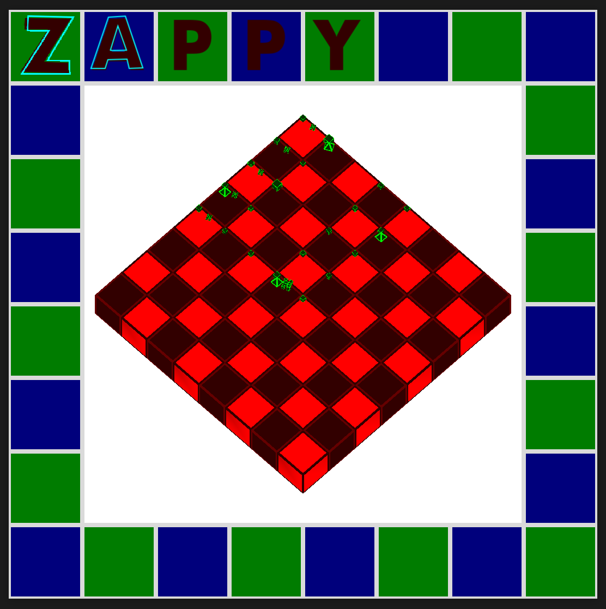
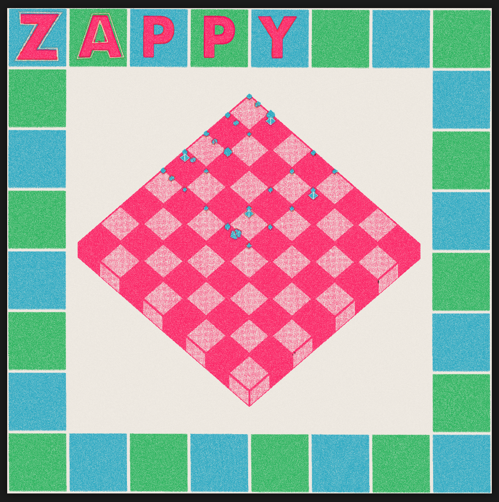

# Zappy GUI - Devlog - 6

## Table of Contents
1. [Looking Good Has Never Been This Easy: You Just Need to Harness All Mathematical Knowledge Ever Compiled Through Human Existence](#61---looking-good-has-never-been-this-easy-you-just-need-to-harness-all-mathematical-knowledge-ever-compiled-through-human-existence)
2. [Shaders 101](#62-shaders-101)
3. [Setting the Stage: A Post-Processing Architecture in Godot](#63-setting-the-stage-a-post-processing-architecture-in-godot)
4. [The Shader Protagonist: A What and a lot of Hows](#64-the-shader-protagonist-a-what-and-a-lot-of-hows)

<br>
<br>

# 6.1 - Looking Good Has Never Been This Easy: You Just Need to Harness All Mathematical Knowledge Ever Compiled Through Human Existence
The first version of this GUI was quite ugly (ngl, fr fr). I tried to go through a minimalist 3D approach, based on clean objects (mostly primitives) through my already classic CRT treatment in a post-processing pass, which resulted in something that 1) I hated, and 2) was way too commonplace in my visual design approach, in a way that didn't fit this project, nor was true to my initial ambitions. Back in the first days of working in the GUI, I had a very clear vision, I wanted to design an interface that looked like a **risograph print**, something that very quickly revealed itself as hard as *insert-here-your-preferred-comparison*. Facing this situation, I did what every sane person would do in the context of this project, run far, far away, without looking back. Well, I did look back, to be fair, constantly, with weeping eyes for what this could be and was not going to be because of cowardice. But now that I'm back at it, I feel like the hiatus might have been beneficial towards this avoidance, maybe because all the walls I hit during those months in a wide array of projects and topics gave me some resilience points, maybe because upon returning this just felt like one more of those battles that never end, one after another: new day, new idea, new hair-pulling-despair. Thing is, this time I decided that there were only going to be two possible outcomes: either I achieved my riso dreams of a better world, or I would just give in to failure and crawl back to wherever corner of existence I should have never come out from. Luckily, things have been going quite well, so I'm not writing from the void, and instead I come bearing cute graphic gifts. I have spent around two weeks working in the rendering pipeline that would take the GUI to the intended aesthetic, in a code war that was very close to being too much for the specific mix that my *here* and my *now* make up to dress the torments of my day to day life. And although the shader I achieved is still a work in progress, and will stay that way at least until this GUI is set up as finished (most likely longer, the amount of effort put into this and the attachment I have to the results will surely call for more experimenting, and it would be a shame if all of this was just left as a GUI implementation in a not so important project), I think this is a good time to break down the current state of its code and, more importantly, what the process was during the development. What concepts and ideas lighted the sparks, how was the general pipeline design, how did the shader code slowly come to life. We will dedicate this entire log to this, mainly for two reasons, one being that there is a lot to say, the other being that graphics programming, in general, and shader coding, in particular, is, at least in my humble opinion, a very complex field. So I really need this recap. Hope it ends up being useful to others, too. Even to you.

As I mentioned, writing shaders is no joke, or at least I stopped laughing like 100 hours of sitting-in front-of-the-failing-graphics ago. In our specific context we will be writing our shader in **Godot's shading language**, which is quite similar to **OpenGL's GLSL**. If you have never gotten into shader programming, this might not be the right entry point for you, and although I will try my best, taking some time to learn shader basics by oneself (types, uniforms, pass structure, color management, ...) might be the right call if you found yourself reading this while wanting to write shaders but never having done so. My current shader code is long and complex, it has a ton of uniforms and functions, and I'm pretty sure that it is messy and needs a lot of refactoring and cleanup, but I myself am in my own graphics programming journey. This is me learning, trying to help others learn along the way, so bare with me if things get out of hand, and get in touch if you have any edits, observations or any other thing you want to tell me in regards to the contents of this log, or any other document while we're at it.

If you want/need resources regarding shader development and graphics programming, my best recommendations are [Freya Holmér's Shader Basics video](https://www.youtube.com/watch?v=kfM-yu0iQBk), [Acerola's whole Youtube channel](https://www.youtube.com/@Acerola_t), and, specifically targeted at learning raw OpenGL, [The Cherno's OpenGL playlist](https://youtu.be/W3gAzLwfIP0?list=PLlrATfBNZ98foTJPJ_Ev03o2oq3-GGOS2), all available on YouTube, and all by what are, to me, teaching superstars. Shout out to them, I owe them so much. If you want to complement these with some theory, I'd say to add [Dan Hollick's Shader page in their Making Software site](https://www.makingsoftware.com/chapters/shaders), which is one of my favorite web pages in the whole world, truly love the design (those graphics and diagrams!!) and how they explain things from the ground up. And top it off with (the sadly unfinished) [Patricio Gonzalez Vivo and Jen Lowe's Book of Shaders](https://thebookofshaders.com/).

> If you're specifically working in Unity and have the money, you can also go for the [Unity Shader Bible](https://jettelly.com/store/the-unity-shaders-bible), a work in progress (actively) that, although aimed at mastering the titular engine, can be easily extrapolated to any other tool, language or approach of your choice.

<br>
<br>

# 6.2 Shaders 101

So. Shaders. Let's talk about what they actually are before we get into the specifics of what I built, because if you've never written one, jumping straight into a multi-layered risograph rendering pipeline with noise functions and animated UV warping is going to feel less like learning and more like being pushed into the deep end of a pool without knowing how to swim.

## What Even Is a Shader

A shader is a small program that runs on your GPU. That's it. Most of the times, when you find the word "shader" out there, in the vast wild, it will refer to a piece of code doing a very specific thing: deciding what color a pixel on your screen should be. That's the whole thing. There's nothing more, trust me. Well, I guess that I should state that any given shader does this *for every pixel, every frame, all at the same time*, in parallel, which is both what makes shaders incredibly powerful and what makes thinking in them feel so alien at first. Like trying to make sense of the Matrix.

Paraphrasing a million explanations on this topic, we could say that your CPU is a very smart worker that does tasks one after another, keeping track of a lot of context and state along the way. Your GPU is thousands of much simpler workers that each do one tiny job simultaneously, with basically no memory of anything else going on around them. When you write a shader, you're writing the instructions for one of those workers. It will be run for every pixel independently, and it cannot look at what its neighbor is doing. It just gets its coordinates, does its hellish math, and outputs a color.

This is a fundamental thing to have in mind when getting into shaders. The code is not written as a loop, but already taking into consideration that it will be executed in a loop, which means that its contents would *"just"* be directed towards the color calculation of the pixels. If going through the loop, the GPU is making calculations for the nth pixel of the output image, it will take into consideration anything we tell it to: mesh information, position, rotation; what light sources there are, what's the ambience context, where is the POV placed; what's the base color, how many effects layer on top of it, what specific conditions are taking place during the rendering. And so on, and so freaking forth.


## The Fragment Shader

There are multiple types of shaders (vertex shaders, compute shaders, geometry shaders...), but the one we care about here is the **fragment shader**, also called a pixel shader depending on the API you're using. In Godot's shading language, it lives inside a `fragment()` function, and this is where all the visual magic happens. Every time the GPU needs to render a pixel covered by your material or canvas item, it calls this function and uses whatever you write into `COLOR` as the result.

```glsl
void fragment() {
    COLOR = vec4(1.0, 0.0, 0.0, 1.0); // everything is red. This should be the first of your neverending shader journey
}
```

That's a complete, valid shader. Not a useful one, but a working one. From here, the entire craft is about making that COLOR output increasingly interesting. Just notice that the code itself is just the `fragment()` function and a single instruction regarding the color of the pixel (full red). The looping call to this function is beyond our reach and our need for reach. We are just telling the GPU: "hey, every time you want to draw a pixel on screen, do this, and by *this* I mean just paint it pure red".

Other shader types are irrelevant for us today, but just know that **vertex shaders** are also quite important, their main role being to transform vertex data, i.e., taking the existing vertices of a mesh and moving them through the rendering pipeline (from model space all the way to screen space). They don't define the mesh itself (that already exists), but instead decide where each vertex ends up on screen and what data gets passed along to the next stages. We don't need to write those in our shader because we're working in a pre-built engine that takes care of that for us. If we build a scene with a cube at 0,0,0, with no rotation and in a default status, the rendering pipeline inside Godot will take care of communicating that data to the GPU. We sort of implicitly write the vertex shader by creating, placing and editing objects in our scene. But because achieving complex results regarding *how they look* is a way more complex thing, most of the time we do need to write the fragment shader ourselves. That's life, and life's hard.

> Going a little bit deeper into **vertex shaders**, we should say that this is also a for-loop that goes through all the vertices of a mesh and takes care (well, *we* take care of it when writing the shader code) of translating their global/world position into their screen position. In other words, where would this specific pixel related to that concrete mesh land on screen after going through the necessary transformations (perspective deformation, camera position, any effects that could have a consequence in this regard, ...). During this translation process, there's a **clip space** sort of in-between, which can be understood as the space where the GPU decides what is visible and what gets discarded (wouldn't make sense to try to draw anything that will not land in the generated image, and if you think about it, how would you even do that?).
>
> **Clip space** is called like that because the GPU actually performs clipping by either keeping, discarding or slicing a triangle (the smallest building block of a mesh). There's complex stuff taking place in all of this, mostly a process that we can tie to what is called the **projection matrix**, the matrix containing all the necessary information for the GPU to know how a mesh is positioned, projected, viewed and modeled, which looks like this:
>
> `vec4 clipPos = projection * view * model * vec4(position, 1.0);`
>
> In clip space, coordinates are still 4D (a 4-part vector), `x, y, z, w`, with the last component, `w`, used to determine how coordinates are scaled and ultimately what ends up visible after projection, clamping XYZ values to `-W`/`W`. And at this point, you might be asking yourself, "what the hell is `W`??? I know about `X`, `Y`, and `Z`, but nobody ever mentioned this fourth weird member of the family, WHAT IS GOING ON???". Totally normal, don't panic. `W` is just an extra coordinate for the GPU to know about projection and depth in a *mathematical way*. Just take it as a value that the GPU will use to transform the raw XYZ values into derived ones affected by how things are positioned, where they are looked from, etc. Or, put in a different way, `W` is the GPU wondering about "how much should this point shrink when projected onto the screen?". And with an example:
>
> `A: (2, 2, ?, w = 1)   → after divide → (2, 2)`
>
> `B: (2, 2, ?, w = 2)   → after divide → (1, 1)`
>
> Both `A` and `B` have the same 2D coordinates, but their different `w` values will result in `B` being scaled further down than `A`, which in human lingo just means that we're using `w` to tell the GPU which point is "farther" in our composition.
>
> And because we're having so much fun and knowing this won't hurt us, here's how a simplified rendering pipeline looks like:
>
> 1. Model space → object's local coordinates
> 2. World space → placed in the scene
> 3. View space → relative to the camera
> 4. Clip space
> 5. NDC (Normalized Device Coordinates) → after dividing by w
> 6. Screen space → pixels

> Also, and FYI, `vertex shaders` would be the ones to use if you wanted to write, say, how a body of water moves, or how the leaves of a tree sway, or how some object is distorted in any other shape or form.

In general terms, and paraphrasing Freya Holmér's video, writing shaders is a frontier discipline, closely tied to visual output (i.e., front-end related), but one that needs a low-level mindset and approach (i.e., back-end feeling). My experience is that writing in `GLSL` (Open`GL` `S`hading `L`anguage) feels like when I build stuff in C/C++, but its applications are always tied to some front-end related tool or context (web design, game development, creative coding, etc), so having a background or at least some rudimentary knowledge in both is always welcomed. Similarly, writing in `HLSL` (`H`igh-`L`evel `S`hader `L`anguage), related to DirectX (and used, for example, in Unity), will benefit from these, and in a broad sense approaches can be easily transferred between languages and pipelines, although never a 1:1 process.

And at this point, you might be asking what the difference is between a **shader** and a **material** in the context of an engine/tool/editor like Unity, Godot, Unreal, Blender, wherever you come from. And it all boils down to data wrapping:
- **A shader is the actual GPU program**, the code that runs on the vertex and fragment stages.
- **A material, on the other hand, is a higher-level construct that wraps that shader together with its parameters** (most of which end up being uniforms). It defines *how* a specific object uses a shader.

In a raw OpenGL context, all of this data would need to be manually provided by us (uniforms, textures, parameters, everything) directly through code (for example, if you were writing your own rendering engine in C++ over [GLFW](https://www.glfw.org/)). But in a pre-built engine, this management is abstracted away and handled through the editor. A mesh provides the per-vertex data (positions, normals, UVs, etc.), while a material provides the configuration that tells the GPU how that data should be rendered. For example, when we add a surface material to a mesh in Godot and set the `albedo` to (1.0, 0, 0), it's roughly equivalent to writing a fragment shader that outputs red. But under the hood, a lot more is happening: lighting, environment contribution, and other effects are automatically integrated into the shader pipeline.

If we want more control, we can switch to a **shader material**, assign a custom shader, and define everything ourselves (via uniforms, functions, and custom logic). Even then, depending on the setup, the engine may still inject or combine additional rendering steps (like lighting), resulting in a final color computed through a layered process. It's also **important to know** that in your regular pre-built engines, **you never add a shader directly to an object: an object always has an intermediary material that holds a reference to our written shader**.

> If you are now wondering what a `uniform` is, they're just variables you set from the CPU side that stay the same for all vertices or fragments during a single draw call. Hence the name. If it helps, think of it this way:
>
> `Vertex Data = each triangle's unique points`
>
> `Uniforms = global settings like: camera position, lighting, time, environment state, etc`
>
> They're also what bridges the CPU code and the GPU code in the how-do-we-control-things lane. Imagine you wanted, I don't know, have the albedo of a cube change when you move the mouse cursor around. You could wire the mouse-detected position vector to a uniform color in the shader file to achieve this. Not necessarily the most practical example, but I hope it makes the point.

## UV Coordinates

The main tool you have for knowing *where* you are as a pixel is `UV`, a two-dimensional coordinate that goes from `(0.0, 0.0)` at the top-left of your texture to `(1.0, 1.0)` at the bottom-right. It doesn't care about resolution. It doesn't care about how many actual pixels there are. It's always this normalized 0-to-1 space, and everything you do spatially in a shader is usually expressed relative to it.

```glsl
void fragment() {
    COLOR = vec4(UV.x, UV.y, 0.0, 1.0);
}
```

This gives you a gradient: black at the top-left, red towards the right, green towards the bottom, yellow at the bottom-right. You've just visualized the UV space itself. This kind of "let me see what this value looks like as a color" debug approach is something you'll do constantly, because shaders don't have print statements or debuggers. **Your only output channel is the screen.** When you want to inspect a value, you assign it to `COLOR` (or a channel of it) and look at the result. Something behaving unexpectedly? Visualize it. Something too dark or too bright? Plug it into red. Something you think should be 0 to 1 but you're not sure? Map it to a color and find out. This is the bread and butter of shader debugging, and the sooner you make it your first instinct, the saner your life will be.

## Types and Vector Math

Shaders live and breathe in vectors. A color is a `vec4` (red, green, blue, alpha) or a `vec3` (just the color channels). A UV coordinate is a `vec2`. You'll be doing a lot of math on these (adding, multiplying, mixing) and the shader language handles it component-wise automatically, which is convenient:

```glsl
vec3 a = vec3(1.0, 0.5, 0.0);
vec3 b = vec3(0.0, 0.5, 1.0);
vec3 c = a + b; // vec3(1.0, 1.0, 1.0) -> white
```

A few functions you'll see absolutely everywhere and should know before going further:

**`mix(a, b, t)`**: linearly interpolates between `a` and `b` based on `t`, where 0.0 returns `a` and 1.0 returns `b`. This is how you blend everything colors, patterns, anything.

**`clamp(x, min, max)`**: keeps a value within a range. Essential for making sure your colors don't go below 0 or above 1, because if they do, things get weird fast.

**`smoothstep(edge0, edge1, x)`**: returns 0 if `x < edge0`, 1 if `x > edge1`, and a smooth curve in between. Think of it as a soft threshold. You'll use this constantly to create soft edges, gradients that feel natural, and blending regions instead of hard cuts.

**`fract(x)`**: returns only the fractional part of a number (everything after the decimal point). `fract(3.7)` is `0.7`. This is the secret ingredient in most noise and tiling techniques because it creates endlessly repeating 0-to-1 patterns.

**`floor(x)`**: rounds down to the nearest integer. Paired with `fract`, this is how you identify *which tile* you're in versus *where within that tile* you are, which is a pattern that shows up constantly in procedural texturing.

## Uniforms

A uniform is a value you pass into a shader from the outside: from your game code, from the inspector, from wherever. It's "uniform" because it stays the same for every pixel during a given draw call (as opposed to `UV`, which is different for every pixel). In Godot, you declare them at the top of the shader:

```glsl
uniform vec3 my_color = vec3(1.0, 0.0, 0.0);
uniform float my_strength = 0.5;
```

They'll show up in the material inspector automatically, which means you can tweak them in real time without recompiling anything. When you're doing visual work, this is the loop that keeps you sane: change a uniform, see the result immediately, iterate. A lot of shader development is essentially just figuring out which uniforms to expose and what ranges make them useful.

## Textures and Sampling

Most of the time your shader isn't working in a vacuum, it's processing a texture, whether that's a sprite, a screen capture, or something else entirely. You sample a texture using the `texture()` function:

```glsl
uniform sampler2D SCREEN_TEXTURE : hint_screen_texture, filter_nearest;

void fragment() {
    vec4 pixel = texture(SCREEN_TEXTURE, UV);
    COLOR = pixel;
}
```

This reads the color at `UV` from `SCREEN_TEXTURE` and outputs it unchanged, which effectively means a pass-through. But now you have the original pixel color to work with, and you can start doing things to it: shift the UV before sampling to distort the image, read the color and replace it with something else based on conditions, sample the same texture at multiple nearby coordinates to fake blur or edge detection. The whole pipeline of this risograph shader is essentially: sample what's already on screen, figure out what ink color each pixel represents, and then *replace* it with a procedurally generated print texture.

## TIME and Animation

The built-in `TIME` variable gives you the elapsed time in seconds since the shader started running. Since the fragment function runs every frame, `TIME` gives you a continuously changing value, which is the hook for any animation. You can feed it into your math to make patterns drift, shimmer, or pulse over time. The key insight is that TIME itself is smooth and continuous, so if you want something to *snap* between states rather than smoothly interpolate (which, as you'll see, is critical for the cel-printed feel of this particular shader), you need to discretize it yourself by rounding or flooring it:

```glsl
float stepped_time = floor(TIME * anim_speed) / anim_speed;
```

This is one of those small things that makes an enormous visual difference. With raw `TIME` everything flows, which looks nice but doesn't look *printed*. With stepped time, the animation advances in discrete jumps, like frames on a filmstrip. That mechanical quality is exactly what gives the shader its risograph character. At least in my mind, that is.

---

And I  think that's enough groundwork to read everything that comes next without getting lost. If any of this felt too fast, the resources linked back in section 6.1 will fill in the gaps, especially Freya's video and the Book of Shaders for the math intuition side of things. If it felt too slow, hang on, because we're about to get into the actual shader, and things are going to get considerably messier. We're basically a fan, so you can easily guess what's coming our way to hit us in our faces.

<br>
<br>

# 6.3 Setting the Stage: A Post-Processing Architecture in Godot
Because we're working in Godot/GLSL and developing a shader in the dark would be crazy (honestly, developing shaders itself is quite crazy, why are you here?), our first task should be to structure our base/test scene in a way that makes it possible to apply a full-screen effect in the first place. And this is where Godot requires a bit of creative plumbing, because applying a post-processing shader in Godot is not as simple as toggling an option. One has to build the pipeline themselves, which can be tricky. But we can rest asure that our goal is pretty straightforward: **render the entire game, then run a shader over the result**. The shader needs to see what the game aready drew, which means **the game's output needs to exist as a textre that the shader can sample**. That's the whole problem of the setup, which I tackled by structuring my `main.tscn` tree like this:

```
Main (Control)
└── PostProcessing (SubViewportContainer)   ← shader lives here
    └── Compositor (SubViewport)            ← full 1080×1080 render target
        ├── GameContainer (SubViewportContainer)
        │   └── GameSubViewport (SubViewport)    ← the actual 3D scene renders here
        │       └── CameraRig
        ├── FrameRoot                        ← UI elements frame grid over the game
        ├── FrameContents
        └── Tooltips
```

As you can see, compositing overlying stuff in Godot can quickly start feeling like making russian dolls, chaining `SubViewportContainer` to `SubViewport` to `SubviewportContainer` to `Subviewport` to... All while taking into consideration that as nodes are placed down the tree they get layered on top of the previous existing nodes. I'll break this down item by item, but first let's list some considerations:
- Layering up rendered items is tricky on itself, but if you also need to handle input passing between rendered layers things will soon get complicated. That was my case, a big headache, as I need my game viewport to be contained in the center of my GUI composition, with framing, ornaments, tooltips and general UI elements on top of it, while being able to interact with the contents of that game viewport via mouse inputs. If you aim for something similar and you're not a super seasoned Godot Developer, you will most likely find in the same situation as me, with a mouse that seems unable o reach the mentioned viewport contents. You'll have to tweak mouse filtering here and there, make the necessary coordination translations by taking into consideration pre-set offsets and learn how to wire mouse movements to specific windows.
    - I, myself, had two type of issues. First, I struggled to just connect the general mouse controls to the camera rig after nesting it deep inside the structure. This was mainly a matter of how and where to filter and/or pass input detections between nodes, the classic juggle-it-till-you-make-it-work. Then, the simple act of decting when the mouse cursor hovers and unhovers a `CollisionShape` inside an `Area3D`, something which is extremely straight forward because these nodes are built in Godot to serve this purpose, became quite complicated. The composed layers made it practically impossible for the engine to properly detect that the cursor was in fact over the `CollisionShape` layouts, which I ended up to manage via some raytracing. And because this was complicated and a whole topic on itself, I'll get into its details in a future devlog.
- Some labeled stuff is strictly related to my GUI design. During this process, after undergoing a couple of crisis, I opted for a square layout, with the game window centered and offset, surrounded by a frame of icons and information, and with an overall tooltip layer to house the hovering information panels that tell about the data, player and resource data. That's why my `Compositor` node is labeled as a 1080x1080 render target, and also why I have several children node branching from said compositor.
    - I needed to nest things like this to make it so everything that's rendered in this GUI goes through the PostProcessing pass. If, for example, the `Tooltips` node was taken outside as an independent child of the `Main` scene, they would still work, but they would not be post-processed. Arriving at this nested compositio was also a sort of long, trial-and-error process. Don't give in to dispair if you go through the same. Things will end up looking and working as you want, you just have to find the way.

## The Inner SubViewport: Rendering the Game

`GameSubVieport` is where the 3D world is actually placed. It's a `SubViewport` node, which in Godot terms means its essentially an **offscreen render target**, a texture that gets drawn into instead of directly onto the screen. If you've ever built a post-processing pipeline, this probably sounds familiar, as it is the basic way of achieving it, going through a 2-step process: render into the offscreen texture, which is normally set up to be the size of the window output (the screen), then render that texture to the screen. The `CameraRig` lives inside this viewport, and everything the camera sees gets captured to this texture. I have it set up to be 810x810 because that's the maximum dimensions I can give it in my 1080x1080 window output once the offset of the rendered frame is taken into consideration (1080 - (135 * 2)).

The `GameContainer` that wraps it is a `SubViewportContainer`, which is what actually displays the `SubViewport`'s texture back into the scene. Think of it as the frame around a painting: the painting is rendered independently, and the container just shows it at the right position and size.

## The Compositor: Compositing Everything Together

`Compositor` is a secod, larger `SubViewport` (1080x1080) that holds the game viewport, the frame UI, the ornament animatons, and the tooltips all as children. Its job is to composite all of those elements into a single flat image. This is the thing the shader will actually process, the full composed frame including everything rendered during execution.

The `PostProcessing` node, which is a `SubViewportContainer`, is what holds the `Compositor` and applies the shader to it. **This is the critical connection: `SubViewportContainer` in Godot allows to assign a `material` to itself, and that materia'ls shader receives the `Subviewport`'s rendered output as `TEXTURE`**. So by assigning the `ShaderMaterial` with the risograph shader to `PostProcessing`, we get exactly what we want: the full composited scene fed into the shader as texture, with the result drawn directly to the screen.

In other words, the data flow is comprised of three nested render targets, but each one has a clear, specific job.:
> **3D scene → GameSubViewport → (composited with 2D UI in Compositor) → PostProcessing shader → screen**

## The Shader Side: Accessing the Texture

One important detail of this architecture is that the shader does **not** actually sample from `SCREEN_TEXTURE`, even though earlier iterations of the effect experimented with it. In the final setup, the shader samples directly from `TEXTURE` instead:

```glsl
vec3 pixel_base = texture(TEXTURE, jittered_UV).rgb;
```


This distinction becomes important once multiple nested viewports enter the picture. In a `canvas_item` shader, `TEXTURE` refers to the texture belonging to the object currently being drawn. Since the shader is attached to `PostProcessing`, which is a `SubViewportContainer`, that texture is automatically the rendered output of its child `SubViewport`. In my  case, the fully composited image produced by Compositor.

Conceptually, Godot is doing something roughly equivalent to:

```
Draw CompositorTexture onto PostProcessing quad
```

When the shader runs on that node, `texture(TEXTURE, uv)`, this means:

```
Sample the texture currently being drawn by this canvas items
```

And for this node, that texture is the Compositor's rendered otput, which already contains the 3D scene, the UI, the ornaments, the tooltips, everything else that might be added to the compositing pass later on.

This makes `TEXTURE` the exact input the post-processing shader needs.

`SCREEN_TEXTURE`, by contrast, refers to something fundamentally different. Rather than sampling the node's own texture, it samples a copy of the framebuffer that has already been rendered behind the current draw call. Conceptually, this is closer to:

```
Give me the pixels that already exist in the framebuffer behind this object
```

In simpler fullscreen shader setups, the distinction is often invisible because the framebuffer and the displayed texture effectively contain the same image. But once rendering becomes layered through nested `SubViewports`, compositing passes, UI overlays, and multiple render targets, the difference becomes significant.

In this architecture, the shader already receives the fully composited image directly through `TEXTURE`. Sampling through `SCREEN_TEXTURE` instead would introduce ambiguity: depending on render order and viewport state, the framebuffer may contain partially rendered data, backend-specific behavior, or intermediate results that are not yet final. Using `TEXTURE` avoids those problems entirely because the shader operates on an explicit, deterministic input texture.

A simple mental model is:

```
TEXTURE        → "This object's image"
SCREEN_TEXTURE → "What has already been rendered behind me"
```

And in this particular pipeline, the object's image is precisely the thing the shader is spposed to process.

## One Pain In the Butt: The Background Color

Because the shader needs to distinguish between "there is something drawn here" and "this is background/empty space", the scene's `WorldEnvironment` has its background set to solid white. The shader checks for near-white pixels and routes them to the paper textre instead of the ink layering pipeline. This is a design decision baked into the detection logic, and it means that if any in-game object is also near-white, it will be treated as background by the shader. For the purposes of this project, this is fine: I know for a fact that there won't be white stuff in my GUI, but I predict some problems down the line if/when I repurpose this shader for anything else.

The `ColorRect` node sitting behind everything in `Main` also contributes here: it fills the whole control with an off-white, ensuring that any pixels that escape the viewport compositing chain are still roughly background-colored rather than black or transparent.

And with all this in place, the scene is ready, and the shader has a clean, full-res texture to work with every frame. Now we can get into the real hard part: how to train your shader.

<br>
<br>

# 6.4 The Shader Protagonist: A What and a lot of Hows
A risograph, if you are unfamiliar with them, is a Japanese printing machine from the 80s originally designed for high-speed document duplication. What makes it interesting to designers is that it prints in separate ink passes, one color at a time, which leads to a very particular set of visual artifacts: **slight misalignment between color layers (misregistration), visible dot patterns where the ink settles on the paper, semi-transparency where inks overlap, and a general organic roughness that digital printing smooths away entirely**. The aesthetic is everywhere in indie illustration and zine culture for exactly this reason: it looks handmade in a way that feels C O O L. And it helps my hopeless soul feel like it is recalling something unnamed that was lost after digitalization seized the human realm of aesthetic outputs.

Now, in the initial conceptual level, faking a risograph efect in a GPU shader means **reverse-engineering these artifacts**. Yu can't actually separate ink passes at render tme, so instead you have to build a system that:
- Identifies which "ink color" each pixel belongs to
- Generates a procedural dot/grain pattern for that color
- Composites the result over a paper texture.

So, let me walk you through the journay that took me there, or the closest I have been able to get to that *there*.

And just as a **before** for our future **after**, and to break this ominous wall of text, here's how the GUI looked in the previous prototype:


## Step 1: A Pass-Through Canvas Shader

The first thing to write is nothing more than a working canvas item shader that samples and re-outputs the scene texture. Before doing anything interesting, the plumbing needs confirmation:

```glsl
shader_type canvas_item;

void fragment() {
    Vec3 pixel = texture(TEXTURE, UV).rgb
    COLOR = vec4(pixel, 1.0)
}
```

If you see your scene rendering normally through this shader, everything went exactly as expected. If you see nothing, black, or the wrong thing, the problem will 99.99999% be in the viewport setup. This is why this first step is important, it's kind of the test for the scene setup.

> As you can see, `fragment()` ends in a `COLOR = Whatever`, which is our perpetual endpoint, the definition of the fragment/pixel color. The other line is just a texture rgb value pickup, which is stored in a `vec3`. As a side note, you can also pick up individual colors and store them as `floats`, or a different amount of channels and store them as the specific amount-type vector, like `vec2` -> `texture().rg`.

## Step2: The Noise Primitive

Everything in this shader (the stipple pattern, the paper grain, the animation jitter) traces back to a single hash function that turns a 2D coordinate into a pseudo-random float in the `0-1` range:

```glsl
float noise(vec2 uv) {
    return fract(sin(dot(uv, vec2(12.9898, 78.233))) * 43658.5453);
}
```

If youre in panic mode because of the nested functon calls and the weird numbers, don't suffer. This is the classic trigonometric hash you'll find in half the shader tutorials on the internet. It's not perlin noise, it's not proper value noise... it's a mathematical trick that produces values that *look* random because of how `sin` behaves at large inputs. The magic numbers (`12.9898`, `78.233`, `43758.5453`) are just well-known irrational-ish constants that produce good distribution. At this stage, write it, then visualize it before moving on:

```glsl
void fragment() {
    float n = noise(UV * 100.0);
    COLOR = vec4(n, n, n, 1.0)
}
```

This should return a uniform static. If it looks strippy or tilted, something is wrong with the constants. If it looks like a gradient, you most likely forgot `fract`. And, maybe, this is your first debug-via-color-output experience. Congratulations!!

> It might be obvious, but the fact that I can tell you were you're most likely making a mistake in the mentioned cases is as simple as: been there, messed that up

### Step 3: Ink Color Detection

This is the real magic of this shader, my little graphics programming son, the pride of my heart. A risograph doesn't really know about gradients, it just prints discrete ink colors, one layer at a time. To fake that, the shader needs to classify each incoming pixel as belonging to one of the defined ink channels. Coming up with a way of doing this took the biggest chunk of the development process, taking me very, very close to the giving up line a handful of times. I ended up going through a **hue-based approach** that worked, thank god, which can be summed up as looking up which color comonent dominates in a base pixel color, and map it to a corresponding ink slot.

```glsl
bool is_red(vec3 c)     { return c.r > c.g * 2.0 && c.r > c.b * 2.0 && c.r > 0.15; }
bool is_green(vec3 c)   { return c.g > c.r * 2.0 && c.g > c.b * 2.0 && c.g > 0.15; }
bool is_blue(vec3 c)    { return c.b > c.r * 2.0 && c.b > c.g * 2.0 && c.b > 0.15; }
bool is_cyan(vec3 c)    { return c.g > c.r * 2.0 && c.b > c.r * 2.0 && c.g > 0.15; }
bool is_magenta(vec3 c) { return c.r > c.g * 2.0 && c.b > c.g * 2.0 && c.r > 0.15; }
bool is_yellow(vec3 c)  { return c.r > c.b * 2.0 && c.g > c.b * 2.0 && c.r > 0.15; }
bool is_black(vec3 c)   { return c.r < 0.1 && c.g < 0.1 && c.b < 0.1; }
bool is_background(vec3 c) { return c.r > 0.9 && c.g > 0.9 && c.b > 0.9; }
```

> I feel that further developing this shader during my time in this Earth will probly change this core, but for now it is giving me exactly the results I need, so, yeah, hurray, halleluyah, etc.

The key implication of this approach is that **the 3D scenes need to be colored in pure, saturated hues**, in a sort of asset-prep pre-step, so as to feed color-controlled meshes to the GUI (red, green, blue objects), rather than subtle, mixed palettes you'd normally use for a realistic rendering. The shader reads those pure colors as ink channel indicators, then *replaces* them entirely with the configured ink colors. **The 3D scene is functioning as a kind of stencil: the geometry and shading define the shapes, and the shader defines the actual printed appearance.**

This is also why the seven ink channels map to the seven color primaries and secondaries of additive/subctractive color: **red, green, blue** (additive primaries), **cyan, magenta, yellow** (subtractive primaries), and **black** (AND YOUR FRIEND STEVE, *cue music*). This gives a full coverage of distinct, easily-detectable hue ranges without detection overlap (ideally, at least). A real risograph approach would very, VERY rarely use more than a 6 ink approach, so if this doesn't work for the shader, the shader is wrong. But luckly, it kinda works.

> There's a couple of next-step risograph characteristics that I'm currently struggling to correctly manage through the shader, mainly **gradients** and **ink transparency overlap**. The first one is tied to the color mapping, which goes hammy ham in the in betweens (think, for example, of a linear gradient between blue and green: it would go through cyan, which would be mapped to a different ink). The second one is tied to this working on *solid* meshes, and by this I mean that having ink overlap would mean to visually have visual object overlap (i.e., object transparency), which is something that directly conflicts the base-color-to-ink mapping. I think that this might be a breaking point for the whole pipeline, not in the sense of the risograph shader not working, but in the sense that if I wanted to have object transparency be translated into ink transparency/overlap, the mentioned core of the process would definately need to change. Let's just put these in our to-do drawer. Problem for future me. Sorry!!

Anyway, at this point you should have enough to write a test `fragment()` that shows you the detection is working:

```glsl
void fragment() {
    vec3 c = texture(TEXTURE, UV).rgb;
    if (is_red(c))     COLOR = vec4(1.0, 0.0, 0.0, 1.0);
    else if (is_green(c)) COLOR = vec4(0.0, 1.0, 0.0, 1.0);
    else               COLOR = vec4(c, 1.0);
}
```

If your red objects turn pure red and your green objects turn pure green, the detection is working correctly. This intermediate test is worth running before moving on because **it will tell you wheter the compositor setup is feeding you the right pixels**, as well as giving you confirmation regarding color uniformity allong the way (i.e., your pure red meshes are being passed as pure red pixels, not dimmed, not darkened, no mixed in values for secondary values).

Here's how my scene composition looks like mid-development, at the exact point in time in which I'm writing this line and a humongous to-do list side-eyes me:



It looks horrible, I know. But wait till you see what the shader does to this. You'll start believing in miracles.

> You might notice at this point that this image has dark green, blue and red colors. That's because I use the darkness/lightness of the color values to make the shader go through one of two output modes, noise based or halftone based. More on that later.

## Step 4: The Stipple Pattern (Noise Mode)

Now we get to the core visual system: the print texture. In a real risograph, ink settles into tiny dots or grain patterns as it hits the paper, and the density of those dots corresponds to how saturated the ink is in that area. Lighter areas have sparser dots, darker areas have denser ones. This needs to be built too.

The first approach is a multi-octave noise field, which means multiple layers of the base `noise()` function stacked at different scales and weights:

```glsl
float ink_noise(vec2 uv, float stepped_time) {
    vec2 anim_offset = vec2(
        noise(vec2(stepped_time * 13.7, 0.0)) - 0.5,
        noise(vec2(0.0, stepped_time * 9.4))  - 0.5
    ) * anim_strength;

    vec2 suv = uv * stipple_scale / stipple_size + anim_offset;
    float a = noise(suv);
    float b = noise(suv * 2.3  + vec2(5.1, 3.7));
    float c = noise(suv * 5.7  + vec2(1.3, 8.2));
    float d = noise(suv * 11.3 + vec2(3.7, 2.1));
    float e = noise(suv * 23.1 + vec2(8.4, 6.3));
    return a * 0.40 + b * 0.25 + c * 0.18 + d * 0.10 + e * 0.07;
}
```

The `suv` scaling is what sets the overall grain size. The offsets (`vec2(5.1, 3.7)` etc.) ensure the octaves don't alias with each other, as without them the layers would partially reinforce each other in reglar patterns that would look structured rather than organic. The weights (`0.40, 0.25, ...`) sum to 1.0 and are tuned so the lowest frequency dominates while the higher frequencies add texture detail.

The `anim_offset` uses `stepped_time` instead of raw `TIME`, which is what causes the animation to advance in discrete jumps rather than flowing continuously. At speed 2, the pattern shifts twice per second to a new random offset, creating a subtle frame-by-frame flicker that echoes the slight inconsistency between ink passes on a real machine. And it also gives it the hand-made-animation-cell vibe that this shader's output needs.

Converting this noise field into a binary "ink hit or not" result involves **comparing against a threshold derived from the pixel's local density**:

```glsl
float noise_hit(vec2 uv, float density, float stepped_time) {
    float d       = clamp(density * noise_density_scale, 0.0, 1.0);
    float pattern = ink_noise(uv, stepped_time);
    float edge    = stipple_softness * 0.5;
    return smoothstep((1.0 - d) - edge, (1.0 - d) + edge, pattern);
}
```

The `density` value (computed later from the pixel's brightness) controls where the threshold sits. A high density value lowers the threshold, meaning more noise samples exceed it and more ink lands. A low density raises it, so fewer samples pass and you get sparse stippling. The `smoothstep` around the threshold gives you slightly soft dot edges rather than a perfectly binary cutoff, which adds to the organic feel.

## Step 5: The Stipple Pattern (Halftone Dots Mode)

The noise field approach works beautifully for fine grain, but for more stylized or magnified print texture you often want something closer to acual halftone dots: discrete, individually-addressable circles arranged on a grid. The second mode generates exactly this:

```glsl
float halftone_hit(vec2 uv, float density, float stepped_time) {
    float cell   = stipple_scale / stipple_size;
    vec2 scaled  = uv * cell;
    vec2 cell_id = floor(scaled);
    vec2 cell_uv = fract(scaled) - 0.5;
    // ...
}
```

The `floor(scaled)` / `fract(scaled)` split is the core pattern that appears in all halftone shader implementations. `cell_id` tells you *which* dot cell you're in (an integer grid coordinate), and `cell_uv` tells you *where within that cell* you are, shifted to be centered at `(0, 0)` instead of `(0, 0) to (1, 1)`. From there, you compute a distance from the center and compare against a radius derived from the density:

```glsl
float radius = sqrt(density) * 0.5 * size_mult;
float dot    = 1.0 - smoothstep(radius - stipple_softness,
                                 radius + stipple_softness, dist);
```

The `sqrt(density)` is important: in a classical halftone, the area of a dot corresponds to the tone value, and area scales as the square of radius, so you need the square root to get perceptually linear density response. Without it, the dots grow too quickly at high densities and fill in too early.

What makes this shader's halftone mode more interesting (and considerably more expensive) than a basic grid is all the per-dot variation layered on top. Each dot has its own static random size, shape squish, rotation, and opacity (derived from hashing `cell_id` against different seed offsets) plus animated equivalents of all of those driven by `stepped_time`. This is what produces the irregular, handmade quality: no two dots in the grid are identical, and each one slightly shifts and breathes frame to frame.

The shape variation is the most visually impactful part:

```glsl
float shape_rand = noise(cell_id + vec2(3.1, 17.9));
float squish     = 1.0 + (shape_rand - 0.5) * 2.0 * dot_shape_variation;
float rot_angle  = shape_rand * 3.14159;
float sr = sin(rot_angle); float cr = cos(rot_angle);
vec2 rotated = mat2(vec2(cr, sr), vec2(-sr, cr)) * (cell_uv - jitter);
rotated.x *= squish;
float dist = length(rotated);
```

Instead of measuring distance from the center using plain `length(cell_uv)` (which gives perfect circles) the UV is first rotated by a random angle and then scaled on one axis by `squish`. This turns every dot into a slightly different ellipse at a slightly different angle, which is exactly what ink spreading on paper actually looks like.

## Step 6: Blending the Two Modes

Rather than choosing one stipple mode or the other, the shader blends between them based on the pixel's density value. Light areas (low density, sparse dots) use the halftone mode; dark areas (high density, near-solid coverage) use the noise field. The transition is controlled by `noise_threshold` and happens via `smoothstep`:

```glsl
float get_hit(vec2 uv, float density, float stepped_time) {
    float h = halftone_hit(uv, density, stepped_time);
    float n = noise_hit(uv, density, stepped_time);
    float t = smoothstep(noise_threshold - noise_threshold_blend,
                         noise_threshold + noise_threshold_blend,
                         density);
    return mix(h, n, t);
}
```

At low densities `t` is 0 and you get pure halftone. At high densities `t` is 1 and you get pure noise. In the middle, they blend. The visual consequence is that fine details and midtones render as dots, while deep shadows and solid fills render as a more chaotic grain texture, which is roughly how risograph ink actually behaves as coverage increases.

## Step 7: Per-Ink Density and Rotation

Real halftone printing typically rotates the dot grid for each color channel to prevent moiré patterns when layers overlap. We do the same: each of the seven ink channels runs `get_hit()` with a slightly different rotation applied to its UV, stepping through approximately 15-degree increments:

```glsl
float hit1 = get_hit(rotate_uv(jittered_UV, 0.0),   density_mult, stepped_time);
float hit2 = get_hit(rotate_uv(jittered_UV, 0.261), density_mult, stepped_time);
float hit3 = get_hit(rotate_uv(jittered_UV, 0.523), density_mult, stepped_time);
// ...and so on for all seven channels
```

The `rotate_uv` helper is just the standard 2D rotation matrix:

```glsl
vec2 rotate_uv(vec2 uv, float angle) {
    float s = sin(angle); float c = cos(angle);
    return mat2(vec2(c, s), vec2(-s, c)) * uv;
}
```

Each channel gets its own `hit` value, a float between 0 and 1 representing how much ink lands on that pixel from that channel. Those values sit unused until the compositing step, but computing them separately per channel is what allows different colors to have different dot patterns in their overlap regions.

The density calculation itself deserves a look. Rather than using a fixed density for all pixels, it derives a value from the brightness of the original pixel:

```glsl
float dominant     = max(pixel_base.r, max(pixel_base.g, pixel_base.b));
float density_mult = mix(density_dark, density_light, dominant);
```

Dark pixels (low `dominant`) get `density_dark` (which defaults to 1.2, meaning heavy ink coverage). Light pixels get `density_light` (0.6, meaning sparse coverage). This is how the shader preserves shading information from the 3D scene: the lighting and shadows that Godot computed for your scene translate directly into ink density, so darker regions in the 3D render appear with denser stippling in the final output.

## Step 8: Misregistration

This is the single most characteristic artifact of risograph printing, and the reason many people love the aesthetic: because each color is printed in a separate physical pass, the paper shifts slightly between passes, and the colors don't land in exactly the same positions. In extreme cases it looks like a 3D anaglyph. In subtle cases it just adds a slight halo of color bleed around object edges.

The shader fakes this by sampling the scene texture at slightly offset UV coordinates for each channel's detection check:

```glsl
vec2 off_top   = offset_top_px   / screen_size;
vec2 off_left  = offset_left_px  / screen_size;
vec2 off_right = offset_right_px / screen_size;

vec3 pixel_top   = texture(TEXTURE, jittered_UV + off_top).rgb;
vec3 pixel_left  = texture(TEXTURE, jittered_UV + off_left).rgb;
vec3 pixel_right = texture(TEXTURE, jittered_UV + off_right).rgb;

bool has_1 = is_red(pixel_base) || is_red(pixel_top) || is_red(pixel_left) || is_red(pixel_right);
```

A channel "activates" at a given pixel if the *original* pixel is that color, *or* if any of the offset samples are that color. This means that at the edge of a red object, the nearby pixels sample into the red area through the offset, causing the ink to bleed slightly outside the object's true boundary. The bleeding is directional (controlled by the offset vectors), and different channels can bleed in different directions, producing the classic chromatic fringing.

The offsets are expressed in pixels and normalized to `screen_size`, so they remain consistent regardless of rendering resolution. The defaults (top: `(1, 1)`, left: `(-1, 0)`, right: `(0, -2)`) are subtle (just a pixel or two) but they're perceptible, especially at object edges. The right amount depends entirely on your aesthetic target.

## Step 9: Global Frame Jitter and Animation

A printed object is static. A risograph *machine* is not, because there are slight inconsistencies between prints due to mechanical tolerances, paper feed, and ink viscosity. To simulate this at a global level rather than a per-pixel level, the shader applies several frame-level distortions driven by `stepped_time`.

The first is a UV shift applied to every pixel, derived from two independent noise samples:

```glsl
vec2 frame_shift = vec2(
    noise(vec2(stepped_time * 31.7, 1.1)) - 0.5,
    noise(vec2(2.3, stepped_time * 27.3)) - 0.5
) * global_frame_jitter;
```

This moves the entire image by a tiny random amount each "frame" (as defined by `anim_speed`), as if the paper shifted slightly on the platen between prints. At the default value of `0.003` it's almost imperceptible, but it prevents the image from feeling perfectly locked in place.

The second is a subtle UV warp, a sinusoidal distortion applied globally that makes the image appear very slightly bent or stretched:

```glsl
float warp_angle = (noise(vec2(stepped_time * 7.1, stepped_time * 5.3)) - 0.5)
                   * frame_warp_strength * 6.28318;
float warp_scale = (noise(vec2(stepped_time * 3.7, stepped_time * 11.1)) - 0.5)
                   * frame_warp_strength;
vec2 frame_warp = vec2(
    sin(UV.y * 3.14159 + warp_angle) * warp_scale,
    cos(UV.x * 3.14159 + warp_angle) * warp_scale
);
```

The multiplication by `6.28318` (2π) means `warp_angle` sweeps through a full rotation over its noise range. The `sin(UV.y * 3.14159)` envelope ensures the warp is zero at the top and bottom edges and maximum in the middle, which prevents the border of the image from visibly swimming.

Both of these are added together into `jittered_UV`, which then replaces `UV` for all subsequent sampling:

```glsl
vec2 jittered_UV = UV + frame_shift + frame_warp;
vec3 pixel_base = texture(TEXTURE, jittered_UV).rgb;
```

## Step 10: Per-Frame Ink Shimmer

Individual ink channels also get a per-frame color shimmer, implemented as a small random offset to each channel's ink color:

```glsl
float shimmer1 = (noise(vec2(stepped_time * 43.1, 1.0)) - 0.5) * 2.0 * frame_ink_shimmer;

vec3 ink1_frame = clamp(ink1 + vec3(shimmer1, -shimmer1 * 0.5, shimmer1 * 0.3), 0.0, 1.0);
```

Each channel gets its own shimmer seed (different multiplier on `stepped_time`) so they drift independently. The color offset is not a uniform shift across all three channels but a structured one: for a red ink, the red channel shifts one way and the other channels shift partially in the opposite direction. This keeps the ink from simply brightening or darkening uniformly, and instead creates a slight hue drift, like ink drying slightly differently between passes.

## Step 11: Paper Texture

Real risograph paper has grain. Not a lot of it, but enough to be visible, especially in areas of light ink coverage. The shader adds this with a single-octave noise sample:

```glsl
float paper_noise = noise(jittered_UV * paper_grain_size + vec2(7.3, 4.1));
```

The offset `vec2(7.3, 4.1)` just ensures this noise sample doesn't alias with the ones used elsewhere in the shader. The result is added to the final color of every pixel (background and inked alike) at a small amplitude (`paper_grain_amount`, defaulting to `0.03`):

```glsl
final_color += vec3((paper_noise - 0.5) * paper_grain_amount);
```

The `- 0.5` centers the noise around zero, so it adds grain that brightens and darkens equally rather than always brightening.


## Step 12: Compositing

With all the pieces computed (hit values for each ink channel, shimmered ink colors, density, paper noise, frame jitter applied) the final step is putting them together:

```glsl
vec3 apply_ink(vec3 base, vec3 ink_color, float hit, float ink_op) {
    return mix(base, ink_color, hit * ink_op);
}

// ...

vec3 final_color = background;
if (has_4) { final_color = apply_ink(final_color, ink4_frame, hit4, ink4_opacity); }
if (has_3) { final_color = apply_ink(final_color, ink3_frame, hit3, ink3_opacity); }
if (has_6) { final_color = apply_ink(final_color, ink6_frame, hit6, ink6_opacity); }
if (has_2) { final_color = apply_ink(final_color, ink2_frame, hit2, ink2_opacity); }
if (has_5) { final_color = apply_ink(final_color, ink5_frame, hit5, ink5_opacity); }
if (has_1) { final_color = apply_ink(final_color, ink1_frame, hit1, ink1_opacity); }
if (has_7) { final_color = apply_ink(final_color, ink7_frame, hit7, ink7_opacity); }

final_color += vec3((paper_noise - 0.5) * paper_grain_amount);
COLOR = vec4(final_color, 1.0);
```

The compositing starts from the paper background color and layers each active ink channel on top via `mix()`, weighted by both the stipple hit value and the ink's opacity. The order matters: inks applied later sit on top of inks applied earlier. The current ordering (cyan → blue → yellow → green → magenta → red → black) is tuned for this specific palette, with black going last so it dominates overlapping regions.

Background pixels skip the layering entirely and go straight to the paper color with grain added. The `transparent_background` uniform, if enabled, skips even that and outputs a transparent pixel, useful if you want to composite the shader output over some other element outside the viewport stack.

---

And that's the whole thing. Broken down step by step, I hope each piece is comprehensible: **a hash function, some detection booleans, a noise field, a halftone grid, a few UV transforms**. What makes it feel complex is that all of these run simultaneously for every pixel on every frame, and the magic only really shows up when you see them all working together. If I had to distill a philosophy for building a shader like this, it would be: start from the simplest possible pass-through, add one system at a time, and visualize each intermediate result as a color before stacking the next layer on top. The shader you end up with will make sense to you in a way that a shader you copied and tweaked never quite will, and when something breaks (AND THINGS WILL BREAK) you'll know exactly where to look.

There's still plenty of room to take this further. The detection logic is currently binary (a pixel is red or it isn't), and a version that computes actual ink weights from the full color would allow for smoother gradients within a single ink channel. The halftone grid could be made anisotropic (dots that stretch along edges rather than being uniformly elliptical). The misregistration could be per-channel rather than shared. But for where this GUI currently sits, the shader does exactly what it set out to do: it makes the screen look like something that came out of a machine, ran on ink, and landed on paper. Which is the exact point at which I can be sort of happy and keep what remains of my sanity.

At the current stage, with lots of things to code and design pending, this is how the horrible composition from the image above looks like when going through the shader:



And here's how it looks in motion (through a shitty screencast gone through an online webm->gif conversor, hence the bad quality of the gif lol), with ink shimmer set to `1.0`, a.k.a. riso-fiesta-mode!!

